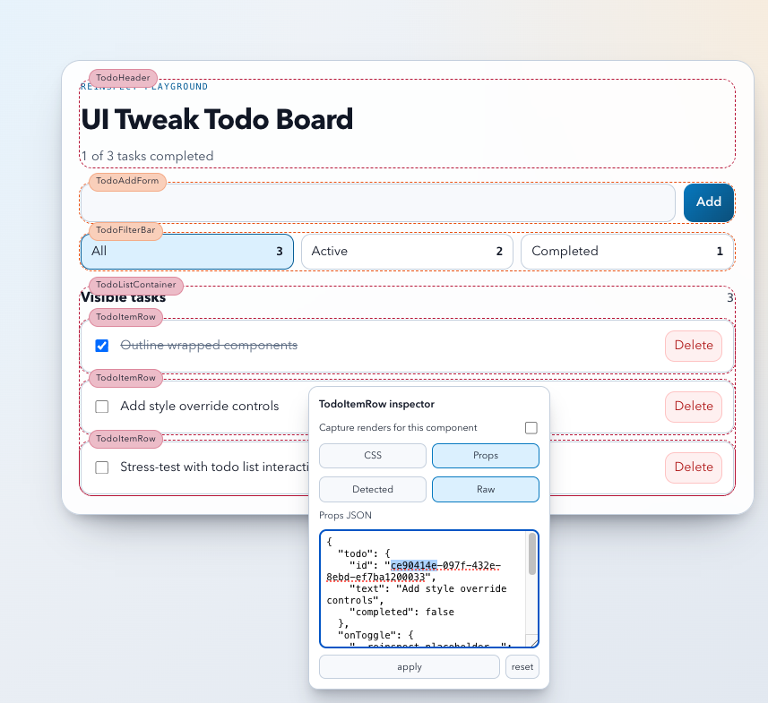

# react-reinspect
Runtime React inspector for real apps.

`react-reinspect` helps you inspect components directly in your running UI:
- See component boundaries and names.
- Right-click any wrapped component to edit style props live.
- Inspect and override props at runtime.
- Track rerenders by attempts, commits, or both.

[](https://www.npmjs.com/package/react-reinspect)
[](https://www.npmjs.com/package/react-reinspect)
[](./LICENSE)

## Why This Exists

React DevTools is excellent for component trees and profiling.  
`react-reinspect` is optimized for *in-context debugging in the page itself*:

- Inspect where a component lives visually.
- Tune common style props instantly.
- Test prop overrides without editing source first.
- Spot rerender hotspots while interacting with the real UI.

## Features

- Runtime overlay + floating settings panel.
- Right-click inspector menu per component.
- CSS prop editing:
  - `backgroundColor`, `color`, `fontSize`, `padding`, `margin`, `borderRadius`, `borderWidth`, `borderColor`, `opacity`, `width`, `height`, `gap`
- Props inspector:
  - `Detected` view for readable values
  - `Raw` JSON editor for direct overrides
  - Function preview + copy source
  - JSON preview + copy for object/array props
- Render counting:
  - Global toggle or per-component toggle
  - Capture mode: `attempts` | `commits` | `both`
- Flexible wrapping:
  - `withReinspect(...)`
  - `wrapInspectableMap(...)`
  - `autoWrapInspectable(...)` (for auto-discovery pipelines)

## Install

```bash
pnpm add react-reinspect
```

Peer dependencies:
- `react >= 18`
- `react-dom >= 18`


## Example




## Quick Start (2 Minutes)


### 1) Wrap your app with `ReinspectProvider`

```tsx
import {
  ReinspectProvider,
  type ReinspectConfig,
} from 'react-reinspect'

const reinspectConfig: ReinspectConfig = {
  enabled: import.meta.env.DEV, // inspect in dev env, turn off in prod 
  // startActive: true, // start with inspector active when page loads
  // showFloatingToggle: true, // show floating react-reinspect settings button
  // inspectMode: 'wrapped', // wrapped: only wrapped components, first-party: wrapped + components with inspectable metadata, all: all components
  // editableProps: DEFAULT_EDITABLE_PROPS, // change the CSS props you can edit
}

export function AppProviders({ children }: { children: React.ReactNode }) {
  return <ReinspectProvider config={reinspectConfig}>{children}</ReinspectProvider>
}
```

### 2) Use it in the browser

- Click `Reinspect settings` button.
- Right-click a wrapped component.
- Switch between `CSS` and `Props` tabs.
- Toggle rerender tracking when needed.

## API

### `ReinspectProvider`

Wrap your app root.

```tsx
<ReinspectProvider config={...}>{children}</ReinspectProvider>
```

### `ReinspectConfig`

| Option | Type | Default | Notes |
|---|---|---|---|
| `enabled` | `boolean` | `import.meta.env.DEV` | Master on/off. |
| `startActive` | `boolean` | `true` | Initial inspector active state. |
| `showFloatingToggle` | `boolean` | `enabled` | Show built-in settings button. |
| `inspectMode` | `'wrapped' \| 'first-party' \| 'all'` | `'wrapped'` | Auto-wrap visibility behavior. |
| `editableProps` | `EditableStyleProp[]` | `DEFAULT_EDITABLE_PROPS` | CSS props editable in inspector. |
| `palette` | `string[]` | `DEFAULT_PALETTE` | Component outline/badge colors. |
| `zIndexBase` | `number` | `2147483000` | Overlay stacking baseline. |
| `shouldCountRenders` | `boolean` | `false` | Global rerender counting. |
| `countRendersForComponents` | `string[]` | `[]` | Enable counting for specific names. |
| `renderCaptureMode` | `'attempts' \| 'commits' \| 'both'` | `'attempts'` | Counter mode shown in badges. |

### `withReinspect(Component, options?)`

Wrap a component manually.

`options`:
- `name?: string`
- `fallbackName?: string`
- `source?: 'manual' | 'auto'`
- `scope?: 'first-party' | 'third-party'`

### `wrapInspectableMap(componentMap, options?)`

Batch-wrap a map of components while preserving prop types.

### `autoWrapInspectable(Component, metadata)`

Helper for auto-discovery transforms.

`metadata`:
- `scope: 'first-party' | 'third-party'`
- `componentName?: string`
- `fallbackName?: string`

### `useReinspect()`

Hook to read/update runtime inspector state from your own UI.

## Production Guidance

- Default behavior is dev-friendly (`enabled` resolves from `import.meta.env.DEV`).
- If you want zero wrapper markup in production, gate wrapping at definition time:

```tsx
import { withReinspect } from 'react-reinspect'

const maybeWrap = <P extends object>(Component: React.ComponentType<P>) =>
  import.meta.env.DEV ? withReinspect(Component) : Component
```

## Development

```bash
pnpm dev
pnpm test
pnpm build:lib
```

## Publish (Maintainers)

This repo can contain a debug/template app, but npm publish only ships package artifacts via the `files` whitelist in `package.json`.

```bash
pnpm build:lib
pnpm pack:check
npm login
pnpm publish:npm
```

## Screenshots To Add (Recommended)

If you want, share screenshots and I will wire them into this README.

Suggested captures:
- Floating settings panel open.
- Right-click CSS editor on a real component.
- Props inspector `Detected` tab with object/function props.
- Rerender badges in `both` mode (`attempts | commits`).
